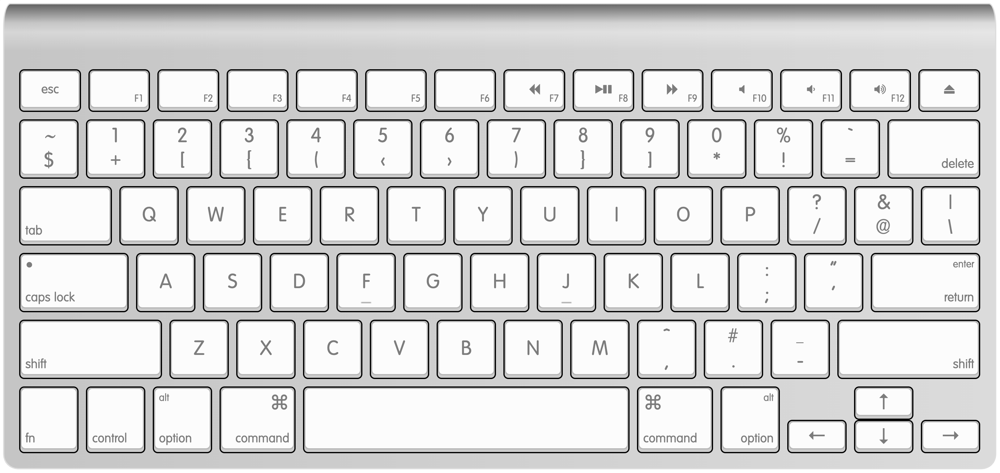

# Programmer QWERTY

## Why?

Because relearning all of my letter and number keys for Dvorak or Colemak is just too much, creating friction for others to use my keyboard for basic typing (and for me to use others' keyboards).

## Installation

On MacOS: 

```bash
sudo cp Programmer\ QWERTY.keylayout /Library/Keyboard\ Layouts/
```

## Preview


